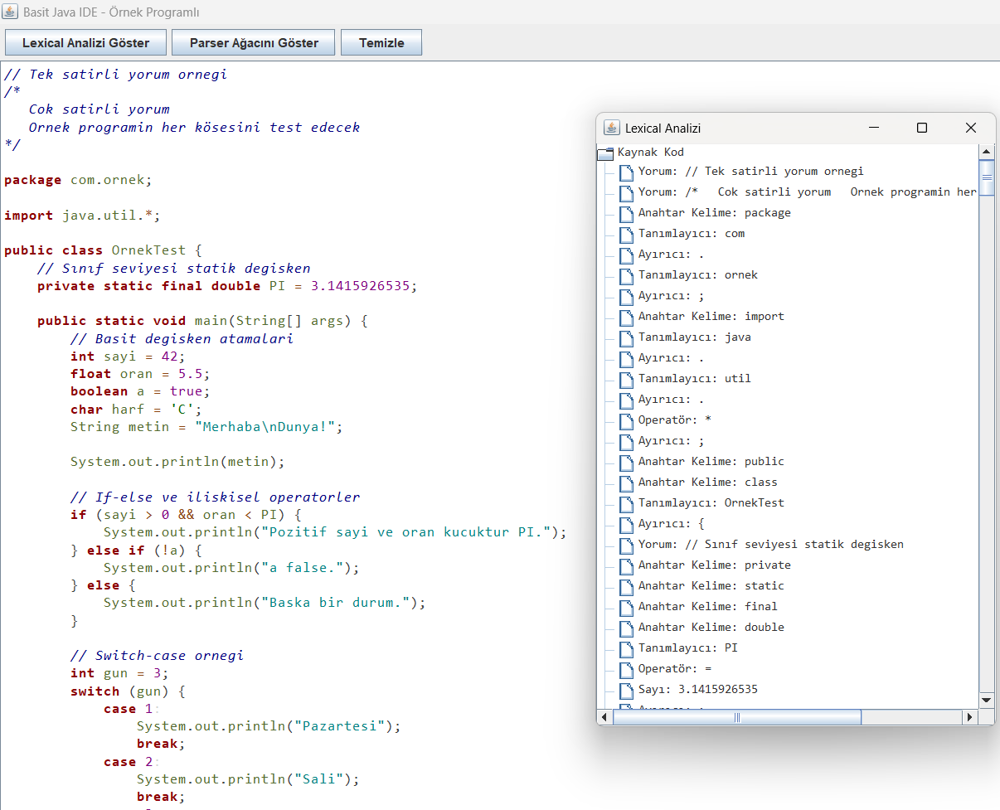
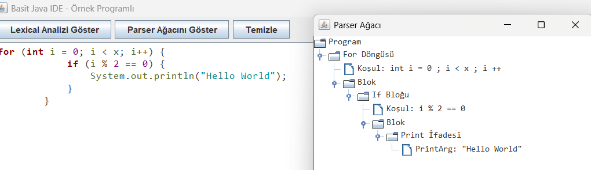

# Java Syntax Highlighter with Real-Time Parsing

Bu proje, Java programlama dili için gerçek zamanlı çalışan bir sözdizimi vurgulayıcı ve sözdizimi analizörü içerir. Swing tabanlı arayüz ile kullanıcı dostu bir editör sunar. Program; `Lexer`, `Parser` ve `Renklendirme` bileşenlerinden oluşur.

### Özellikler

- Gerçek zamanlı renklendirme (Syntax Highlighting)
- En az 5 farklı token türü desteği (keyword, operator, literal, identifier, comment, ...)
- Java'ya özgü kapsamlı token desteği (`try`, `catch`, `package`, `this`, `new`, vb.)
- Top-Down parser ile Java kodunun AST (Abstract Syntax Tree) analizi
- Lexical analiz ve parse ağacını görsel olarak gösterme
- Örnek kod yükleme, kod temizleme, otomatik yeniden renklendirme

### Kullanım

**Derleme:**

```
javac *.java
```

**Çalıştırma:**

```
java ArayuzTasarimi
```

### Bileşenler

- **Lexer.java**: Regex tabanlı lexical analiz
- **Token.java**: Token türleri ve içerikleri
- **Parser.java**: Token listesinden syntax ağacı üretimi
- **Renklendirme.java**: Token tipine göre stil atama
- **ArayuzTasarimi.java**: Swing tabanlı GUI

### Ekran Görüntüleri

#### Arayüz


#### Lexical



#### Parse Tree



### Demo Videosu

Demo video bağlantısı:
[Video için tıklayın.](https://www.youtube.com/watch?v=ehHHEId7my0)

### Makale

### Dökümantasyon

[Dökümantasyon dosyasına buradan ulaşabilirsiniz.](./documentation.md)

### Makale Linki:
[Eklenecek]

---

Bu proje **bitkicayi - Burak Ege Yaşar - tarafından** geliştirilmiştir.
