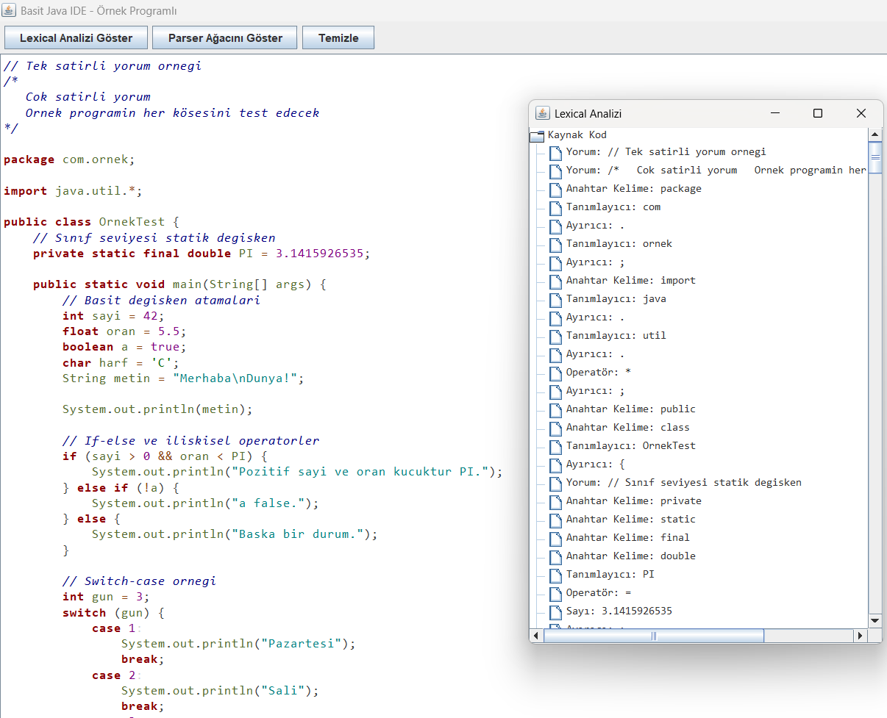
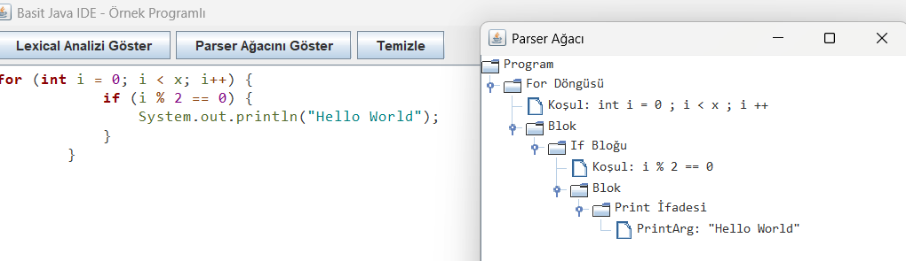
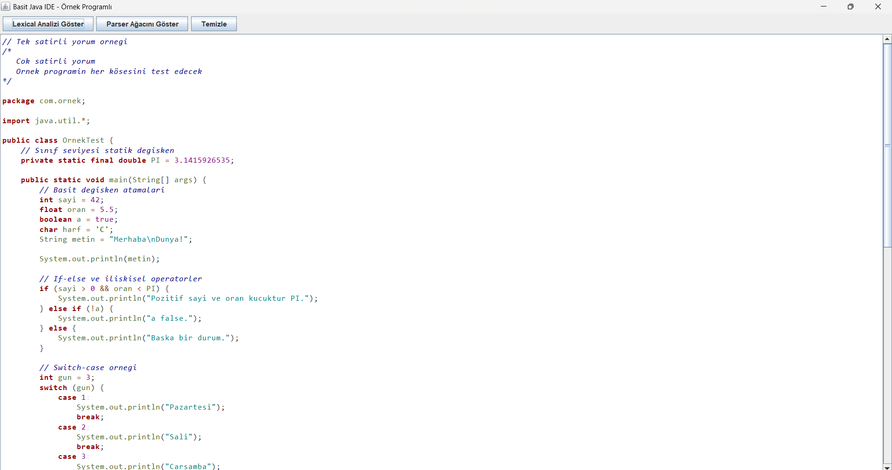

## Genel Bakış

---

### Projenin Amacı

Bu proje, Java programlama diline ait kaynak kodların **gerçek zamanlı olarak sözdizimsel analizini yapmak** ve bu kodlara **renk temelli sözdizimi vurgulaması uygulamak** amacıyla geliştirilmiştir. Kullanıcı bir editöre Java kodunu yazarken:

- Kod anında analiz edilir,
- Token'lar tanımlanır,
- Token türlerine göre renkli biçimde vurgulanır,
- Syntax yapısı çıkarılır ve ağaç olarak gösterilir.

Uygulama, hem sözdizimsel yapıların tanımlanmasını hem de görsel olarak kullanıcıya sunulmasını sağlar. Proje, derleyici tasarımı ve programlama dilleri dersinde teori olarak öğrenilen **lexical analysis (tokenization)** ve **parsing (sözdizimsel analiz)** süreçlerini uygulamalı hale getirir.

---

### Çözülen Problemler

1. **Gerçek zamanlı analiz:** Kullanıcının kod yazarken anlık olarak token’lara ayrılması ve renklendirilmesi.
2. **Kullanıcı dostu arayüz:** GUI üzerinden analizlerin tetiklenebilmesi ve çıktılarının görselleştirilebilmesi.
3. **Kapsamlı token desteği:** Java dilinin temel yapıları (if, while, class, try-catch, vs.) tanınabilir.
4. **Sözdizimi ağacının gösterimi:** Kodun yapısal anlamda nasıl analiz edildiğinin görsel sunumu.

---

### Kullanılan Teknolojiler

| Teknoloji / Yöntem                | Açıklama                                    |
| --------------------------------- | ------------------------------------------- |
| Java 21                           | Ana programlama dili                        |
| Java Swing                        | GUI (grafiksel kullanıcı arayüzü) oluşturma |
| `StyledDocument`                  | `JTextPane` üzerindeki renklendirme için    |
| Regular Expressions               | Token tanıma kuralları için                 |
| Top-Down Parsing                  | Sözdizim analiz stratejisi                  |
| `JTree`, `DefaultMutableTreeNode` | Ağaç yapılarını göstermek için              |

---

### Projenin Hedef Kriterleri

Bu proje, aşağıdaki temel kriterleri sağlamak üzere geliştirilmiştir:

| Kriter                                                      | Durum |
| ----------------------------------------------------------- | ----- |
| En az 5 farklı token türü vurgulanmalı                      | ✅    |
| Gerçek zamanlı analiz yapılmalı                             | ✅    |
| GUI tabanlı olmalı                                          | ✅    |
| Lexical analiz regex temelli olmalı                         | ✅    |
| Syntax analizi CFG tabanlı parser ile yapılmalı             | ✅    |
| Hiçbir hazır highlighting/parser kütüphanesi kullanılmamalı | ✅    |

---

### Demo Kullanım Senaryosu (Kısa)

Kullanıcı, uygulamayı çalıştırdığında karşısına örnek bir Java kodu yüklü olarak gelen bir arayüz açılır. Kullanıcı bu kodu değiştirerek ya da sıfırdan yazarak:

- Yazdığı kodun anında renklendirildiğini görür.
- "Lexical Analizi Göster" butonuna basarak token ağacını görüntüler.
- "Parser Ağacını Göster" ile ağaç yapısını elde eder.
- "Temizle" butonuyla editörü sıfırlar.

Bu deneyim, kullanıcıya derleyici aşamalarının mantığını hem uygulamalı hem de görsel olarak sunar.

---

## Proje Yapısı ve Sınıflar

Uygulama toplamda **5 ana sınıf** kullanılarak modüler ve genişletilebilir bir yapıda tasarlanmıştır. Her sınıf kendi sorumluluk alanına sahiptir ve sınıflar arasında düşük bağımlılık prensibine uyulmuştur.

### Sınıfların Genel Yapısı

```
.
├── ArayuzTasarimi.java      # Swing tabanlı arayüz
├── Lexer.java               # Lexical analyzer (token üretici)
├── Parser.java              # Top-Down Recursive Parser
├── Renklendirme.java        # Syntax highlighting renk eşleyicisi
└── Token.java               # Token yapısı ve tür tanımı
```

---

### `Lexer.java`

- **Görevi:** Girilen kaynak kodu `regular expression` kurallarına göre token’lara ayırmak.
- **Temel Metot:** `public List<Token> parcalama(String kaynakMetin)`
- **İşleyiş:** Kod karakter karakter taranır. Tanımlı regex kuralları sırasıyla denenerek eşleşen parçalar token’a dönüştürülür.
- **Esneklik:** Yeni regex kuralları eklenerek farklı token türleri desteklenebilir.

---

### `Token.java`

- **Görevi:** Her token’ı temsil eden veri yapısını tanımlar.
- **Yapı:**

  - `String icerik`: Token içeriği
  - `Tur tur`: Token türü (enum)
  - `int baslangicIndex`, `int bitisIndex`: Editörde renklendirme için konum bilgileri

- **Enum Türleri:**

  - `ANAHTAR_SOZCUK_DO`, `TAM_SAYI_SABIT`, `ARTIRMA_OPERATOR`, `NOKTA`, `ANAHTAR_SOZCUK_IMPLEMENTS`, `TEK_SATIR_YORUM`, `YENI_SATIR`, vs.

- **Kullanım Alanı:**

  - Lexer çıktısı olarak
  - Renklendirme sistemine bilgi taşıyıcı olarak
  - Parser girdisi olarak

---

### `Renklendirme.java`

- **Görevi:** Her token türüne özel renk ve stil eşleyerek GUI’de gösterimi sağlar.
- **Temel Metot:** `private void renkleriTanimla()`
- **Kullanılan Java Bileşenleri:**

  - `SimpleAttributeSet`
  - `StyleConstants`

- **Mantık:** Token türüne göre önceden tanımlanmış renk/stil bilgileri GUI bileşenine aktarılır.

---

### `Parser.java`

- **Görevi:** Token listesinden geçerli bir Java programının parse ağacını oluşturan `Recursive Descent Parser`.
- **Ana Metotlar:**

  - `parseAsAgac()`
  - `parseIfAsNode()`, `parseDonguAsNode()`gibi yapısal analiz fonksiyonları

- **Ağaç Yapısı:**

  - `DefaultMutableTreeNode` kullanılarak `JTree` uyumlu şekilde oluşturulur.
  - Düğümler anlamlı stringlerle etiketlenir.

---

### `ArayuzTasarimi.java`

- **Görevi:** Tüm sistemi GUI üzerinden kullanıcıyla buluşturan sınıf.
- **Bileşenler:**

  - `JTextPane kodPane`: Editör bileşeni
  - `JButton`: Lexical ve Parser butonları
  - `JTree`: Token ve parse ağacı gösterimi

- **İşlevsellik:**

  - Kod değişince `Lexer` ve `Renklendirme` anlık olarak tetiklenir.
  - Butonlar üzerinden kullanıcı analizleri manuel başlatabilir.

- **Otomasyon:** Başlangıçta örnek Java kodu otomatik yüklenir.

---

### Sınıflar Arası İlişki Şeması

```
+------------------+
| ArayuzTasarimi   |
|------------------|
| kullanır         |
v                  |
+------------------+      +----------------+
| Lexer            | ---> | Token.java     |
+------------------+      +----------------+
| döndürür List<Token>   ↑
|                        |
v                        |
+------------------+     |
| Renklendirme     | <---+
+------------------+

+------------------+
| Parser           |
+------------------+
| kullanır List<Token> -> Üretir: Parse Tree
```

---

## Lexical Analiz (Tokenizer)

Lexical analiz aşaması, kaynak koddaki karakterlerin **anlamlı kelime birimlerine (token)** dönüştürülmesi işlemidir. Bu projede `Lexer.java` sınıfı, Java kaynak kodunu tarayarak tanımlı token türlerine göre ayırır ve her birini `Token` nesnesi olarak listeye ekler.

---

### Temel Kavramlar

- **Token:** Kodun en küçük anlamlı parçasıdır (örneğin `int`, `x`, `=`, `5`, `;`).
- **Tur (Enum):** Her token’a ait tür (`ANAHTAR_SOZCUK_INT`, `ATAMA_OPERATOR`, `NOKTALI_VIRGUL`, vs.)
- **Regex:** Tanımlı yapılarla karakter eşleşmesi sağlar (`[a-zA-Z_][a-zA-Z0-9_]*` gibi).

---

### Lexer İşleyişi

```java
public List<Token> parcalama(String kaynakMetin)
```

Bu metod, verilen string (kod) üzerinde soldan sağa ilerleyerek her karakter aralığını aşağıdaki sırayla test eder:

1. **Anahtar kelime mi?**
2. **Yorum satırı mı? (`//` veya `/* */`)**
3. **Sayı mı?**
4. **String veya karakter mi?**
5. **Operatör mü? (`+`, `=`, `==`, vb.)**
6. **Ayırıcı mı? (`(`, `)`, `{`, `}`, `;`)**
7. **Tanımlayıcı (identifier) mı?**
8. **Hiçbirine uymuyorsa bilinmeyen olarak işaretlenir.**

Her eşleşme bir `Token` nesnesine dönüştürülür ve listeye eklenir. Eşleşme başarısızsa `1 karakter` ileri gidilir ve döngü tekrarlar.

---

### Desteklenen Token Türleri

| Token Türü           | Açıklama                          | Örnek Regex veya Değer                 |
| -------------------- | --------------------------------- | -------------------------------------- |
| ANAHTAR_SOZCUK_CLASS | Sınıf tanımı anahtar kelimesi     | `class`                                |
| ANAHTAR_SOZCUK_IF    | Koşul yapısı başlangıcı           | `if`                                   |
| TANIMLAYICI          | Kullanıcı tanımlı isim            | `[a-zA-Z_][a-zA-Z0-9_]*`               |
| TAM_SAYI_SABIT       | Tam sayı sabiti                   | `42`, `100`, `0`                       |
| STRING_DIZI_SABIT    | Çift tırnak içinde string         | `"merhaba"`                            |
| ATAMA_OPERATOR       | Atama operatörü                   | `=`                                    |
| ESITMI_OPERATOR      | Karşılaştırma (eşit mi?)          | `==`                                   |
| AC_PARANTEZ          | Açılış parantezi                  | `(`                                    |
| TEK_SATIR_YORUM      | Satır sonuna kadar yorum          | `// bu bir yorum`                      |
| DIGER                | Tanınmayan veya geçersiz karakter | `@`, `~`, `#` gibi işlenmeyen simgeler |

---

### Token Yapısı (Token.java)

```java
public Token(Tur tokenTur, String icerik, int baslangicIndex, int bitisIndex) {
        this.tokenTur = tokenTur;
        this.icerik = icerik;
        this.baslangicIndex = baslangicIndex;
        this.bitisIndex = bitisIndex;
    }
```

`baslangicIndex` ve `bitisIndex` indeksleri, editörde sözcüğün renklendirilmesini sağlar. `icerik` değeri doğrudan eşleşen metindir.

---

### Örnek: Koddan Token’a

```java
int x = 42;
```

Bu satırdan şu `Token` listesi üretilir:

| Token | Türü               | Pozisyon (başlangıç - bitiş) |
| ----- | ------------------ | ---------------------------- |
| `int` | ANAHTAR_SOZCUK_INT | 0 - 3                        |
| `x`   | TANIMLAYICI        | 4 - 5                        |
| `=`   | ATAMA_OPERATOR     | 6 - 7                        |
| `42`  | TAM_SAYI_SABIT     | 8 - 10                       |
| `;`   | NOKTALI_VIRGUL     | 10 - 11                      |

---

### Lexer’in Çıktısı Nerede Kullanılır?

1. **Renklendirme.java** – Token türüne göre `StyledDocument` içinde renk belirlenir.
2. **Parser.java** – Token listesi üzerinden parse işlemi başlatılır.
3. **Lexical Analizi Göster** – Token listesi `JTree` ile ağaç olarak görselleştirilir.

---

### Genişletilebilirlik

Lexer yapısı, `private final Map<Pattern, Token.Tur> regexKurallari;` biçiminde bir kurallar koleksiyonu kullanır. Bu sayede:

- Yeni token türleri kolayca eklenebilir
- Kuralların sıralaması önceliği belirler

---

## 4. Parser Yapısı ve Sözdizimi Analizi

Parser, `Lexer` tarafından üretilmiş token listesini alarak bu token dizisinin **anlamlı bir program yapısına (parse tree)** uygun olup olmadığını kontrol eder ve bu yapıyı üretir. Bu işlem, belirli bir **Context-Free Grammar (CFG)** tanımına göre yapılır.

Projemizde bu görev `Parser.java` sınıfı tarafından `Top-Down Recursive Descent` yaklaşımı ile gerçekleştirilir.

---

### Parser’ın Girdisi ve Çıktısı

- **Girdi:** `List<Token>` (Lexer çıktısı)
- **Çıktı:** `DefaultMutableTreeNode` türünde parse ağacı (JTree ile gösterilir)
- **Hedef:** Java dilinin temel sözdizimsel yapılarını tanımak ve bunları hiyerarşik bir ağaç olarak yapılandırmak

---

### Desteklenen Yapılar

Parser sınıfı, aşağıdaki temel Java yapıları tanıyacak şekilde tasarlanmıştır:

| Yapı             | Örnek Kod                     |
| ---------------- | ----------------------------- |
| Değişken tanımı  | `int x = 5;`                  |
| Atama            | `x = x + 1;`                  |
| If-Else          | `if (x > 0) {...} else {...}` |
| While döngüsü    | `while (x < 10) {...}`        |
| Return ifadeleri | `return x;`                   |
| Metot tanımı     | `public void foo() {}`        |
| Blok yapıları    | `{ ... }`                     |

---

### Temel Parse Metotları

#### `parseAsAgac()`

- Ana giriş noktasıdır. Token listesinin başından sonuna kadar tüm yapıları tek tek kontrol eder.
- Her yapı tanındığında ilgili `parseXAsNode()` metodu çağrılır ve oluşturulan düğümler `Program` kök düğümüne eklenir.
- Ağaç yapısı `DefaultMutableTreeNode` ile temsil edilir.

#### `parseSinifAsNode()`

- `class` anahtar kelimesiyle başlayan sınıf yapısını tanır.
- İçerisinde metod, değişken, if veya döngü olabilir.
- Her iç yapı kendi `DefaultMutableTreeNode` düğümü olarak eklenir.

#### `parseMetotAsNode()`

- Erişim belirleyici (`public`, `private`, ...) ve dönüş tipi (`int`, `void`, ...) ile başlayan metotları tanır.
- Metot adı, parametreler ve gövde yapısı analiz edilir.
- İçinde alt yapılar: `return`, `if`, `for`, `while`, `do`, değişken tanımları veya basit ifadeler olabilir.

#### `parseDegiskenTanimiAsNode()`

- Veri tipi (örn. `int`) ile başlayan değişken tanımlarını tanır.
- Değişken adı ve varsa atanan sabit değer düğüm olarak eklenir.

#### `parseReturnAsNode()`

- `return` ifadesini tanır ve ardından gelen sabit değerle birlikte bir düğüm oluşturur.

#### `parseIfAsNode()`

- `if (...) { ... }` yapısını tanır.
- İçerideki her yapı (değişken, return, nested if/döngü/basit ifade) birer alt düğüm olarak eklenir.
- `else` bloğu varsa, `If Bloğu` altına `Else Bloğu` olarak eklenir.

#### `parseDonguAsNode()`

- `for`, `while`, `do-while` gibi döngü yapılarını tanır.
- İçerik süslü parantez dengesiyle analiz edilir.
- İç yapılar yine alt düğüm olarak eklenir.

#### `parseBasitIfadeAsNode()`

- `break;`, `continue;`, `System.out.println(...);` gibi basit ifadeleri tanır.
- Uygun şekilde düğüm oluşturup üst yapıya eklenmesini sağlar.

---

#### Örnek:

```java
if (x > 0) {
    return x;
}
```

Ağaç çıktısı:

```
Program
└── If Bloğu
    ├── Koşul: x > 0
    └── Blok
        └── Return İfadesi
            └── Dönen Değer: x

```

---

### Hata Yönetimi

Parser, geçersiz veya eksik yapılarla karşılaştığında:

- Ağacın üretilmesine devam eder (toleranslı analiz).
- Uygulama çökmez, sadece eksik düğümler oluşabilir.

---

### Genişletilebilirlik

`Parser` sınıfı **modüler ve esnek** biçimde tasarlanmıştır. Yeni sözdizimsel yapılar kolayca entegre edilebilir:

1. `parseAsAgac()` içinde sırayla kontrol edilen bloklara yenisi eklenir:

   - Örn: `parseTryCatchAsNode()` gibi.

2. Bu yapıya özel yeni bir metot yazılır:

   - Örn: `parseTryCatchAsNode()` metodu ile `try { ... } catch (...) { ... }` bloklarını ayrıştırmak mümkündür.

3. Eğer gerekli ise `Token.Tur` sınıfına yeni bir tür tanımı eklenir:

   - Örn: `ANAHTAR_SOZCUK_TRY`, `ANAHTAR_SOZCUK_CATCH`, `ANAHTAR_SOZCUK_FINALLY`

Bu yapı sayesinde sistem; `switch-case`, `try-catch`, `synchronized` blokları, lambda ifadeleri gibi gelişmiş Java yapılarıyla da genişletilmeye hazırdır.

---

### Parser'ın Sınırlamaları

- Sadece belirli yapılar tanınır (tam Java grammar değil)
- Çoklu atama veya karmaşık ifadelere sınırlı destek vardır
- `switch-case`, `interface`, `enum` gibi yapılar destek dışındadır

---

## Renklendirme Sistemi (Syntax Highlighting)

Kullanıcının yazdığı Java kodunun anlık olarak renklendirilmesi, hem okunabilirliği artırır hem de kullanıcıya yazdığı kod hakkında anında görsel geri bildirim verir. Bu proje kapsamında bu işlevi `Renklendirme.java` sınıfı gerçekleştirir.

---

### Kullanılan Java Teknolojileri

| Bileşen              | Amaç                                     |
| -------------------- | ---------------------------------------- |
| `JTextPane`          | Editör olarak kullanılan bileşen         |
| `StyledDocument`     | Yazı biçimlendirme API’si                |
| `SimpleAttributeSet` | Karakterlere stil (renk, kalınlık) atama |
| `StyleConstants`     | Renk, kalınlık, italik gibi nitelikler   |

---

### İşleyiş Mantığı

1. Kullanıcı kod editöründe bir tuşa bastığında `keyReleased` olayı tetiklenir.
2. Kodun tamamı `Lexer.parcalama()` metoduna gönderilir.
3. Elde edilen `List<Token>` her bir token için:

   - Başlangıç ve bitiş konumu belirlenir.
   - Token türüne göre uygun `Color` ve stil seçilir.
   - Bu bilgiler `StyledDocument` üzerinde uygulanır.

Bu işlem milisaniyeler içinde gerçekleşir, bu sayede kullanıcı yazarken kesintisiz vurgulama yapılır.

---

### Token Türlerine Göre Renk/Stil Eşlemesi

`public List<ColorSpan> renklendir(List<Token> tokenlar)` metodu, her token türü için sabit bir `SimpleAttributeSet` döndürür.

| Token Grubu                                                                                        | Renk Kodu                       | Stil   |
| -------------------------------------------------------------------------------------------------- | ------------------------------- | ------ |
| Anahtar Sözcükler (`ANAHTAR_SOZCUK_...`)                                                           | Koyu Kırmızı `#8B0000`          | Kalın  |
| String Dizileri (`STRING_DIZI_SABIT`)                                                              | Turkuaz `#008080`               | Normal |
| Karakter Sabitleri (`KARAKTER_SABIT`)                                                              | Koyu Yeşil `#006400`            | Normal |
| Sayısal & Boolean Sabitler (`TAM_SAYI_SABIT`, `ONDALIK_SAYI_SABIT`, `BOOLEAN_SABIT`, `NULL_SABIT`) | Mor `#800080`                   | Normal |
| Yorumlar (`TEK_SATIR_YORUM`, `COK_SATIR_YORUM`)                                                    | Koyu Mavi `#000080`             | İtalik |
| Operatörler (`ARTIRMA_OPERATOR`, `ESITMI_OPERATOR`, ...)                                           | Turuncumsu Kahverengi `#8B4513` | Normal |
| Ayırıcılar (`NOKTALI_VIRGUL`, `AC_PARANTEZ`, ...)                                                  | Gri `#404040`                   | Normal |
| Tanımlayıcılar (`TANIMLAYICI`)                                                                     | Zeytin Yeşili `#556B2F`         | Normal |
| Diğer / Boşluklar (`DIGER`, `BOSLUK`, `YENI_SATIR`, `SEKME`)                                       | Açık Gri `#D3D3D3`              | Normal |

---

### Vurgulama Akışı (Adım Adım)

```java
kodPane.addKeyListener(new KeyAdapter() {
    @Override
    public void keyReleased(KeyEvent e) {
        String icerik = kodPane.getText(); // Editördeki kodu al
        List<Token> tokenlar = lexer.parcalama(icerik); // Lexer ile tokenlara ayır
        List<Renklendirme.ColorSpan> spanler = renklendirme.renklendir(tokenlar); // Renklendirme için span listesi al
        StyledDocument doc = kodPane.getStyledDocument();

        // Önce tüm karakterlerin stilini temizle
        doc.setCharacterAttributes(0, icerik.length(), new SimpleAttributeSet(), true);

        // Token'lara göre renklendirme uygula
        for (Renklendirme.ColorSpan span : spanler) {
            doc.setCharacterAttributes(
                span.getBaslangic(),
                span.getUzunluk(),
                span.getStil(),
                true
            );
        }
    }
});
```

---

### Gerçek Zamanlılık

Renklendirme `keyReleased` olayında tetiklendiği için:

- Kullanıcı kod yazarken gecikme olmadan renkler güncellenir.
- Mevcut tüm `Token`’lar yeniden işlenir.
- Hatalı kod da renklendirilir (örneğin bilinmeyenler kırmızı olur).

---

### Örnek

```java
public class Hello {
    public static void main(String[] args) {
      int x = 10; // sayı
      System.out.println("Merhaba");
    }
}
```

Renklendirme çıktısı:

- `public`, `class`, `int` → **Kırmızı ve kalın**
- `x`, `System`, `out`, `println` → **Siyah**
- `10`, `"Merhaba"` → **Mavi**
- `// sayı` → **Gri ve italik**
- `=` ve `;` → **Yeşil/Turuncu**

---

## Kullanıcı Arayüzü ve Pencereler (GUI)

Proje, kullanıcı etkileşimini kolaylaştırmak için `Java Swing` kütüphanesi kullanılarak grafiksel bir kullanıcı arayüzü ile sunulmuştur. Arayüz, kullanıcıya kod girişi, lexical analiz, syntax analiz ve ağaç gösterimi gibi tüm işlevleri butonlar ve pencereler aracılığıyla sunar.

---

### Arayüz Yapısı

`ArayuzTasarimi.java` sınıfı, GUI bileşenlerinin tümünü kapsar ve kontrol eder. Uygulama şu bölümlerden oluşur:

1. **Kod Editörü (JTextPane)**
2. **Buton Paneli (JPanel + JButton)**
3. **Analiz Çıktısı Pencereleri (JTree + JScrollPane)**
4. **Örnek Kod Yükleyici**
5. **Temizle Butonu**

---

### Bileşen Listesi ve Görevleri

| Bileşen                | Swing Sınıfı            | Açıklama                                          |
| ---------------------- | ----------------------- | ------------------------------------------------- |
| Kod Editörü            | `JTextPane kodPane`     | Java kodunun yazıldığı alan                       |
| Lexical Analizi Göster | `JButton btnLexical`    | Token listesini ağaç halinde gösterir             |
| Parser Ağacını Göster  | `JButton btnParserTree` | Üretilen parse ağacını `JTree` ile açar           |
| Temizle Butonu         | `JButton btnTemizle`    | Editördeki tüm metni siler                        |
| Token/Syntax Ağacı     | `JTree`                 | Token veya parse sonuçlarını gösteren görsel ağaç |
| Açılır Pencereler      | `JScrollPane`           | Ağaçları barındıran kaydırılabilir pencere        |

---

### Kullanıcı Etkileşimi

| Kullanıcı Eylemi                          | Sistem Tepkisi                                |
| ----------------------------------------- | --------------------------------------------- |
| Kod yazma                                 | Otomatik renklendirme (real-time)             |
| "Lexical Analizi Göster" butonuna tıklama | Token listesi açılır (ağaç formatında)        |
| "Parser Ağacını Göster" tıklama           | Son parse ağacı yeni bir pencerede gösterilir |
| "Temizle" tıklama                         | Kod editörü boşaltılır                        |

---

### Arayüzde Örnek Kod Yüklenmesi

Program ilk çalıştırıldığında `JTextPane` içerisine otomatik olarak örnek bir Java kodu yüklenir. Bu kod sayesinde kullanıcı herhangi bir işlem yapmadan yapının nasıl çalıştığını gözlemleyebilir.

---

### Olay Tetikleme Yapısı

- **Kod Editörü:** Her tuş bırakıldığında `keyReleased` dinleyicisi tetiklenir ve `Lexer` + `Renklendirme` çalışır.
- **Butonlar:** Her biri `ActionListener` ile ilişkilidir. Tıklanma olayında ilgili analiz fonksiyonları çağrılır.

---

### Kullanıcı Deneyimi Akışı

```
Kullanıcı Yazıyor
      ↓
KeyReleased → Lexer.parcalama() → Token List
      ↓
Renklendirme.java → Renkler Güncellenir
      ↓
Butona Tıklanır → Parser.java → Parse Tree
      ↓
Yeni Pencerede Ağaç Görünümü Açılır
```

---

### Arayüz Ekran Görüntüleri

- 
- 
-  

---

### Genişletilebilirlik

- Arayüze yeni butonlar eklenebilir (örn. AST gösterimi, dosya aç/kaydet).
- `JTabbedPane` ile çoklu sekmeli editör desteklenebilir.
- Kodda "hata" varsa kullanıcıya uyarı etiketi gösterilebilir (örn. JLabel).

---

## Parser Ağacı Yapısı ve Gösterimi

Parser’ın görevi yalnızca sözdizimini kontrol etmek değil, aynı zamanda programın yapısal olarak ne ifade ettiğini **hiyerarşik bir biçimde temsil eden ağaç yapısını** üretmektir. Bu ağaç, kullanıcının yazdığı kodun **Abstract Syntax Tree (AST)** veya **Parse Tree** şeklinde sunulmasıdır.

---

### Ağaç Veri Yapısı

Uygulamada ağaç yapısı Java Swing'in `DefaultMutableTreeNode` sınıfı ile modellenir. Bu yapı, `JTree` bileşeniyle kolayca entegre edilebilir ve görsel olarak ağaç diyagramı halinde sunulabilir.

```java
DefaultMutableTreeNode root = new DefaultMutableTreeNode("Program");
```

Her `Node` (düğüm):

- String olarak etiketlenir
- Alt ifadeleri varsa eklenir
- `JTree` içinde gösterilmek üzere kök düğümden itibaren dallanır

---

### Yapı Örneği: `if` ve `return`

Kod:

```java
if (x > 0) {
    return x;
}
```

Ağaç temsili:

```
Program
└── If Bloğu
    ├── Koşul: x > 0
    └── Blok
        └── Return İfadesi
            └── Dönen Değer: x

```

Bu yapı kullanıcıya kodun mantıksal bloklarını daha net şekilde gösterir.

---

### Ağaç Gösterimi: `JTree`

- Parse ağacı, kullanıcı **"Parser Ağacını Göster"** butonuna bastığında ayrı bir pencerede (`JFrame`) açılır.
- Ağaç yapısı, kaydırılabilirlik için `JScrollPane` içerisinde `JTree` bileşeni ile gösterilir.
- Kök düğüm `"Program"` olarak oluşturulur.
- Alt düğümler, programdaki yapısal blokları yansıtarak sıralanır.
- Her bir blok veya ifade, kendi alt ögelerini içeren hiyerarşik bir dal olarak ağaçta yer alır.
- Kullanıcı ağacı genişletip daraltarak programın mantıksal yapısını inceleyebilir.

---

### Görsel Yapının Kurulumu

```java
btnParserTree.addActionListener(e -> {
            String kod = kodPane.getText();
            List<Token> tokenlar = lexer.parcalama(kod);
            Parser parser = new Parser(tokenlar);
            DefaultMutableTreeNode root = parser.parseAsAgac();
            JFrame treeFrame = new JFrame("Parser Ağacı");
            treeFrame.setSize(400, 650);
            treeFrame.setLocationRelativeTo(this);
            JTree tree = new JTree(root);
            tree.setFont(new Font("Consolas", Font.PLAIN, 12));
            treeFrame.add(new JScrollPane(tree));
            treeFrame.setVisible(true);
        });
```

Bu yapı sayesinde kullanıcı, analiz edilen kodun hiyerarşisini doğrudan gözlemleyebilir.

---

### Teknik Notlar

- `parseAsAgac()` metodu, tüm programın kök düğümünü (AST root) döndürür.
- Her bir `parse...AsNode()` fonksiyonu, kendi sorumlu olduğu dil yapısının ilgili alt düğümlerini oluşturur ve ağaca ekler.
- Eğer herhangi bir parse fonksiyonu `null` dönerse, ilgili yapının ağaca eklenmemesi sağlanır; bu sayede analiz eksik de olsa sistem çalışmaya devam eder ve çökmeye yol açmaz.

---

### Gerçek Kod Örneği

Kod:

```java
int a = 3;
while (a < 5) {
    a = a + 1;
}
```

Oluşan ağaç:

```
Program
├── Değişken Tanımı
│   ├── Veri Tipi: int
│   ├── Tanımlayıcı: a
│   └── Sabit Değer: 3
└── While Döngüsü
    ├── Condition: a < 5
    └── Block
        └── Değişken Tanımı
            ├── Tanımlayıcı: a
            └── Sabit Değer: a + 1

```

---

### Hata Dayanıklılığı

- Eksik parantez, unutulmuş `;` gibi hatalarda ağaç yapısı eksik oluşturulur ama gösterim devam eder.
- Kullanıcıya uygulamanın hata verdiği yerine, kısmi analiz çıktısı sunulur.

---

## Gerçek Zamanlılık ve Etkileşim Akışı

Projenin en önemli hedeflerinden biri, **kullanıcının yazdığı Java kodunu anında analiz edip renklendirmek ve görsel geri bildirim sağlamaktır**. Bu sayede kullanıcı, yazım esnasında hataları fark edebilir ve program yapısını daha iyi kavrayabilir.

---

### Gerçek Zamanlılık Nedir?

Gerçek zamanlılık, editöre her karakter girişinde veya silindiğinde sistemin:

- Lexical analiz yapmasını,
- Token üretmesini,
- Token'ları renklendirmesini
  anında gerçekleştirmesi demektir.

---

### Sürekli Etkileşim Döngüsü

#### Kullanıcının klavye etkileşimi:

```
          Kullanıcı Tuşa Basar
                    ↓
          keyReleased Olayı Tetiklenir
                    ↓
            Lexer.parcalama() → Token Listesi
                    ↓
          Renklendirme.java → Renk/Stil Belirleme
                    ↓
        StyledDocument → JTextPane'e Uygulama
```

Bu döngü, her tuş bırakıldığında çalışır ve editördeki tüm kod baştan analiz edilerek renklendirilir.

---

### Etkileşimli Butonlar ve Akış

#### **Lexical Analizi Göster**

- Token listesi `JTree` olarak yeni bir pencereye açılır.
- Token türleri ve içerikleri düğüm yapısıyla sunulur.

#### **Parser Ağacını Göster**

- Son üretilen parse ağacı, tüm dallarıyla yeni bir pencerede açılır.

#### **Temizle**

- Kod editörünü tamamen temizler.
- Arayüz sıfırlanır, otomatik renklendirme pasif kalır (kod girilene kadar).

---

### Gerçek Zamanlı Renklendirme Örneği

Editöre aşağıdaki Java satırı yazıldığında:

```java
int x = 5;
```

Uygulama aşağıdaki adımları **anlık olarak**, yani yazım esnasında gerçekleştirir:

| Aşama               | Çıktı                                                                                     |
| ------------------- | ----------------------------------------------------------------------------------------- |
| `Lexer` çıktısı     | `int`, `x`, `=`, `5`, `;`                                                                 |
| Token türleri       | `ANAHTAR_SOZCUK_INT`, `TANIMLAYICI`, `ATAMA_OPERATOR`, `TAM_SAYI_SABIT`, `NOKTALI_VIRGUL` |
| Renklendirme sonucu | `int` koyu kırmızı (kalın), `x` zeytin yeşili, `5` mor, `;` gri                           |

Bu işlem, `keyReleased` olayında tetiklenir ve renklendirme editörde **gerçek zamanlı** olarak görünür hale gelir.

---

---

### Performans ve Verimlilik

- Her girişte `Lexer` tüm metni yeniden işler. Kod kısa olduğundan yüksek performans korunur.
- `StyledDocument` doğrudan boyalı alanları güncellediği için ekran gecikmesi yaşanmaz.
- Sistem büyük kod blokları için daha ileri düzey optimizasyonlara da uygun yapıdadır (örneğin satır bazlı vurgulama gelecekte eklenebilir).

---

### Zamanlama Akışı Özet Diyagramı

```
╔═════════════╗
║ Kullanıcı   ║
║ Kod Yazar   ║
╚══════╤══════╝
       ↓ keyReleased
╔══════╧══════╗
║    Lexer    ║ → Token List
╚══════╤══════╝
       ↓
╔══════╧═════════════╗
║ Renklendirme.java  ║ → Stil Atama
╚══════╤═════════════╝
       ↓
╔══════╧══════╗
║ JTextPane   ║ ← Renkli Kod
╚═════════════╝
```

## Test Senaryoları ve Hata Yönetimi

Bu bölümde uygulamanın hem doğru hem de hatalı kod girişleri altında nasıl davrandığı test edilmiştir. Proje, hatalı kodlarda kullanıcıya doğrudan uyarı vermez; ancak **çökmeden çalışmaya devam eder**. Bu, uygulamanın temel hata toleransı sağladığını gösterir.

---

### 8.1 Doğru Kod Senaryosu

```java
public class Hello {
    public static void main(String[] args) {
        int x = 10;
        if (x > 0) {
            System.out.println("Pozitif");
        } else {
            System.out.println("Negatif");
        }
    }
}
```

Bu kod:

- **Lexer** tarafından token’lara başarılı şekilde ayrıştırılır.
- **Renklendirme** sistemiyle anahtar kelimeler kırmızı, stringler mavi, değişkenler siyah renklendirilir.
- **Parser** ile tüm yapı `Program -> Sınıf -> Metod -> Değişken Tanımı -> If Bloğu -> Koşul -> Blok -> Print` gibi bir ağaçla görselleştirilir.

---

### Hatalı Kod Senaryoları

Projenin mevcut hali doğrudan bir "hata listesi" oluşturmaz ancak syntax analiz sırasında bozuk veya eksik yapıları **atlayarak** devam eder. Yani:

- **Parse işlemi eksik veya yanlış ağaçlar oluşturabilir, ancak uygulama hata vermez.**
- GUI’de veya konsolda "yanlış" mesajı çıkmaz.

#### Örnek: Eksik Noktalı Virgül

```java
int x = 10
int y = 5;
```

- `Lexer` çalışır.
- `Parser`, `x = 10` ifadesinde `;` beklenmediği için kalan parse işlemini atlayabilir.
- Ağaç çıktısı eksik olur, ama uygulama hata vermez.

#### Örnek: Bozuk `if` yapısı

```java
if (x > 0 {
    return x;
}
```

- `(` kapatılmadığı için `Parser` beklenen ifadeyi bulamaz.
- `if` yapısı eksik parse edilir, ancak ağaç gösterimi yine de yapılır (boş blok olabilir).

---

### 🛠️ 8.3 Mevcut Hata Yönetimi Özeti

| Özellik                                   | Mevcut? | Açıklama                                        |
| ----------------------------------------- | ------- | ----------------------------------------------- |
| Hata listesi (listeye yazma)              | ❌      | Yok, doğrudan tutulmuyor                        |
| Parse sırasında kırılmadan devam          | ✅      | Yapılar eksik olsa da parse işlemi tamamlanıyor |
| GUI üzerinden hata gösterimi              | ❌      | Hatalar kullanıcıya gösterilmiyor               |
| Yorumları ve bilinmeyen token’ları atlama | ✅      | Lexer bilinmeyen yapıları yok sayabiliyor       |

---

### İyileştirme Önerileri

Gelecekte sisteme şu özellikler eklenebilir:

1. **Hata Listesi Oluşturma**
   Parser sınıfına hataları tutan bir yapı eklenip hangi satırda ne eksik olduğu tutulabilir.

2. **GUI’ye Hata Paneli**
   Hatalar kullanıcıya `JTextArea` veya `JOptionPane` ile sunulabilir.

3. **Hatalı Kodların Renkle Belirtilmesi**
   Eksik `;`, `{` gibi durumlarda arka plan renkleriyle uyarı yapılabilir.

---

### Sonuç

- Proje, temel düzeyde hata toleransı sağlayacak biçimde parse işlemini sürdürmektedir.
- Hatalar sistemin çalışmasını engellemez; yalnızca parse ağacının eksik olmasına yol açar.
- Bu davranış, gerçek zamanlı vurgulayıcı IDE'ler için uygun ve yeterli bir temeldir.

---
